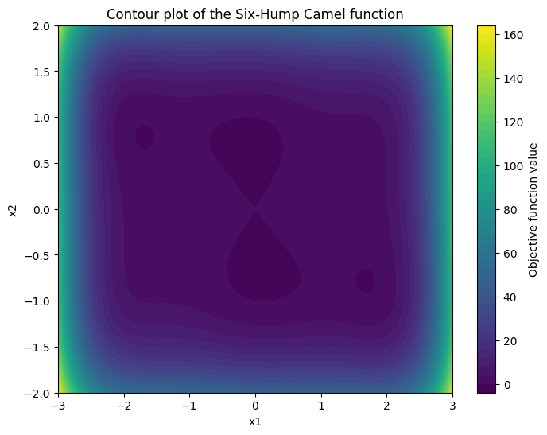
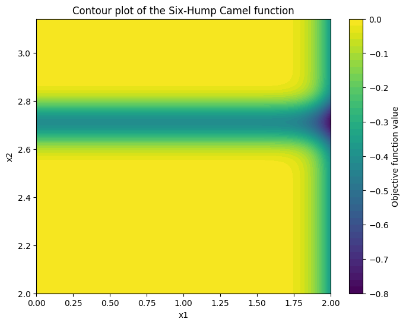

```python
!pip install GPopt nnetsauce
```


```python
import GPopt as gp
import nnetsauce as ns
import numpy as np
import pandas as pd
import matplotlib.pyplot as plt

from sklearn.ensemble import RandomForestRegressor, ExtraTreesRegressor
from sklearn.linear_model import RidgeCV, LassoCV
from sklearn.kernel_ridge import KernelRidge
from sklearn.svm import SVR
from sklearn.model_selection import cross_val_score
from scipy.optimize import minimize
from statsmodels.nonparametric.smoothers_lowess import lowess


# Six-Hump Camel Function (Objective function, to be minimized)
def six_hump_camel(x):
    """
    Six-Hump Camel Function:
    - Global minima located at:
      (0.0898, -0.7126),
      (-0.0898, 0.7126)
    - Function value at the minima: f(x) = -1.0316
    """
    x1 = x[0]
    x2 = x[1]
    term1 = (4 - 2.1 * x1**2 + (x1**4) / 3) * x1**2
    term2 = x1 * x2
    term3 = (-4 + 4 * x2**2) * x2**2
    return term1 + term2 + term3
```


```python
import matplotlib.pyplot as plt
import numpy as np
# Generate a grid of points in the input space
x = np.linspace(-3, 3, 100)
y = np.linspace(-2, 2, 100)
X, Y = np.meshgrid(x, y)

# Evaluate the objective function at each point in the grid
Z = np.zeros_like(X)
for i in range(X.shape[0]):
    for j in range(X.shape[1]):
        Z[i, j] = six_hump_camel([X[i, j], Y[i, j]])

# Plot the contour map
plt.figure(figsize=(8, 6))
contour = plt.contourf(X, Y, Z, levels=50, cmap='viridis')
plt.colorbar(contour, label='Objective function value')
plt.title('Contour plot of the Six-Hump Camel function')
plt.xlabel('x1')
plt.ylabel('x2')
plt.show()
```


    

    


```python
from sklearn.utils import all_estimators
from tqdm import tqdm

# Get all available scikit-learn estimators
estimators = all_estimators(type_filter='regressor')

results = []

# Loop through all regressors
for name, RegressorClass in tqdm(estimators):
    try:
        # Instantiate the regressor (you might need to handle potential exceptions or required parameters)
        regressor = RegressorClass()
        print(f"\n Successfully instantiated regressor: {name} ----------")
        # GPopt for Bayesian optimization
        gp_opt = gp.GPOpt(objective_func=six_hump_camel,
                          lower_bound = np.array([-3, -2]),
                          upper_bound = np.array([3, 2]),
                          acquisition="ucb",
                          method="splitconformal",
                          surrogate_obj=ns.PredictionInterval(regressor), # Any surrogate model can be used, thanks to nnetsauce
                          n_init=10,
                          n_iter=190,
                          seed=432)
        print(f"gp_opt.method: {gp_opt.method}")
        res = gp_opt.optimize(verbose=1, ucb_tol=1e-6)
        print(f"\n\n result: {res}")
        display(res.best_params)
        display(res.best_score)
        results.append((name, res))

    except Exception as e:
        print(f"Could not instantiate regressor {name}: {e}")

```

    
  0%|          | 0/55 [00:00<?, ?it/s]

    
     Successfully instantiated regressor: ARDRegression ----------
    gp_opt.method: splitconformal
    
     Creating initial design... 
    
    
     ...Done. 
    
    
     Optimization loop... 
    
    190/190 [██████████████████████████████] - 1s 8ms/step
    
    
     result: DescribeResult(best_params=array([-0.06650758, -0.66453519]), best_score=np.float64(-0.9245124394795201))


    array([-0.06650758, -0.66453519])


    np.float64(-0.9245124394795201)


    
  2%|▏         | 1/55 [00:02<02:30,  2.79s/it]

    
     Successfully instantiated regressor: AdaBoostRegressor ----------
    gp_opt.method: splitconformal
    
     Creating initial design... 
    
    
     ...Done. 
    
    
     Optimization loop... 
    
    190/190 [██████████████████████████████] - 63s 332ms/step
    
    
     result: DescribeResult(best_params=array([ 0.09375, -0.8125 ]), best_score=np.float64(-0.938577521033585))


    array([ 0.09375, -0.8125 ])


    np.float64(-0.938577521033585)


    
  4%|▎         | 2/55 [01:06<34:22, 38.91s/it]

    
     Successfully instantiated regressor: BaggingRegressor ----------
    gp_opt.method: splitconformal
    
     Creating initial design... 
    
    
     ...Done. 
    
    
     Optimization loop... 
    
    190/190 [██████████████████████████████] - 14s 74ms/step
    
    
     result: DescribeResult(best_params=array([ 0.09649658, -0.71691895]), best_score=np.float64(-1.0313347256499197))


    array([ 0.09649658, -0.71691895])


    np.float64(-1.0313347256499197)


    
  5%|▌         | 3/55 [01:21<24:10, 27.90s/it]

    
     Successfully instantiated regressor: BayesianRidge ----------
    gp_opt.method: splitconformal
    
     Creating initial design... 
    
    
     ...Done. 
    
    
     Optimization loop... 
    
    190/190 [██████████████████████████████] - 1s 5ms/step
    
    
     result: DescribeResult(best_params=array([-0.06650758, -0.66453519]), best_score=np.float64(-0.9245124394795201))


    array([-0.06650758, -0.66453519])


    np.float64(-0.9245124394795201)


    
  7%|▋         | 4/55 [01:23<14:56, 17.57s/it]

    
     Successfully instantiated regressor: CCA ----------


    
  9%|▉         | 5/55 [01:24<09:35, 11.50s/it]

    gp_opt.method: splitconformal
    
     Creating initial design... 
    
    Could not instantiate regressor CCA: `n_components` upper bound is 1. Got 2 instead. Reduce `n_components`.
    
     Successfully instantiated regressor: DecisionTreeRegressor ----------
    gp_opt.method: splitconformal
    
     Creating initial design... 
    
    
     ...Done. 
    
    
     Optimization loop... 
    
    190/190 [██████████████████████████████] - 2s 9ms/step
    
    
     result: DescribeResult(best_params=array([ 0.08203125, -0.6640625 ]), best_score=np.float64(-1.0137184499462486))


    array([ 0.08203125, -0.6640625 ])


    np.float64(-1.0137184499462486)


    
 11%|█         | 6/55 [01:26<06:52,  8.43s/it]

    
     Successfully instantiated regressor: DummyRegressor ----------
    gp_opt.method: splitconformal
    
     Creating initial design... 
    
    
     ...Done. 
    
    
     Optimization loop... 
    
    190/190 [██████████████████████████████] - 1s 4ms/step
    
    
     result: DescribeResult(best_params=array([-0.06650758, -0.66453519]), best_score=np.float64(-0.9245124394795201))


    array([-0.06650758, -0.66453519])


    np.float64(-0.9245124394795201)


    
 13%|█▎        | 7/55 [01:28<05:00,  6.26s/it]

    
     Successfully instantiated regressor: ElasticNet ----------
    gp_opt.method: splitconformal
    
     Creating initial design... 
    
    
     ...Done. 
    
    
     Optimization loop... 
    
    190/190 [██████████████████████████████] - 1s 5ms/step
    
    
     result: DescribeResult(best_params=array([-0.06650758, -0.66453519]), best_score=np.float64(-0.9245124394795201))


    array([-0.06650758, -0.66453519])


    np.float64(-0.9245124394795201)


    
 15%|█▍        | 8/55 [01:30<03:52,  4.95s/it]

    
     Successfully instantiated regressor: ElasticNetCV ----------
    gp_opt.method: splitconformal
    
     Creating initial design... 
    
    
     ...Done. 
    
    
     Optimization loop... 
    
    190/190 [██████████████████████████████] - 13s 68ms/step
    
    
     result: DescribeResult(best_params=array([-0.06650758, -0.66453519]), best_score=np.float64(-0.9245124394795201))


    array([-0.06650758, -0.66453519])


    np.float64(-0.9245124394795201)


    
 16%|█▋        | 9/55 [01:44<05:54,  7.72s/it]

    
     Successfully instantiated regressor: ExtraTreeRegressor ----------
    gp_opt.method: splitconformal
    
     Creating initial design... 
    
    
     ...Done. 
    
    
     Optimization loop... 
    
    190/190 [██████████████████████████████] - 1s 8ms/step
    
    
     result: DescribeResult(best_params=array([ 0.08203125, -0.6640625 ]), best_score=np.float64(-1.0137184499462486))


    array([ 0.08203125, -0.6640625 ])


    np.float64(-1.0137184499462486)


    
 18%|█▊        | 10/55 [01:46<04:30,  6.02s/it]

    
     Successfully instantiated regressor: ExtraTreesRegressor ----------
    gp_opt.method: splitconformal
    
     Creating initial design... 
    
    
     ...Done. 
    
    
     Optimization loop... 
    
    190/190 [██████████████████████████████] - 94s 492ms/step
    
    
     result: DescribeResult(best_params=array([-0.05877686, -0.66418457]), best_score=np.float64(-0.9333100344965217))


    array([-0.05877686, -0.66418457])


    np.float64(-0.9333100344965217)


    
 20%|██        | 11/55 [03:21<24:16, 33.10s/it]

    
     Successfully instantiated regressor: GammaRegressor ----------
    gp_opt.method: splitconformal
    
     Creating initial design... 
    
    
     ...Done. 
    
    
     Optimization loop... 
    
      9/190 [█.............................] - ETA: 6s

    
 22%|██▏       | 12/55 [03:22<16:53, 23.56s/it]

    Could not instantiate regressor GammaRegressor: Some value(s) of y are out of the valid range of the loss 'HalfGammaLoss'.
    
     Successfully instantiated regressor: GaussianProcessRegressor ----------
    gp_opt.method: splitconformal
    
     Creating initial design... 
    
    
     ...Done. 
    
    
     Optimization loop... 
    
    190/190 [██████████████████████████████] - 54s 282ms/step
    
    
     result: DescribeResult(best_params=array([ 0.09649658, -0.71691895]), best_score=np.float64(-1.0313347256499197))


    array([ 0.09649658, -0.71691895])


    np.float64(-1.0313347256499197)


    
 24%|██▎       | 13/55 [04:17<23:08, 33.05s/it]

    
     Successfully instantiated regressor: GradientBoostingRegressor ----------
    gp_opt.method: splitconformal
    
     Creating initial design... 
    
    
     ...Done. 
    
    
     Optimization loop... 
    
    190/190 [██████████████████████████████] - 32s 171ms/step
    
    
     result: DescribeResult(best_params=array([ 0.04907227, -0.71142578]), best_score=np.float64(-1.025140955917896))


    array([ 0.04907227, -0.71142578])


    np.float64(-1.025140955917896)


    
 25%|██▌       | 14/55 [04:51<22:39, 33.15s/it]

    
     Successfully instantiated regressor: HistGradientBoostingRegressor ----------
    gp_opt.method: splitconformal
    
     Creating initial design... 
    
    
     ...Done. 
    
    
     Optimization loop... 
    
    190/190 [██████████████████████████████] - 62s 324ms/step
    
    
     result: DescribeResult(best_params=array([-0.00732422, -0.72167969]), best_score=np.float64(-0.9927655380892927))


    array([-0.00732422, -0.72167969])


    np.float64(-0.9927655380892927)


    
 27%|██▋       | 15/55 [05:54<28:03, 42.09s/it]

    
     Successfully instantiated regressor: HuberRegressor ----------
    gp_opt.method: splitconformal
    
     Creating initial design... 
    
    
     ...Done. 
    
    
     Optimization loop... 
    
    190/190 [██████████████████████████████] - 3s 18ms/step
    
    
     result: DescribeResult(best_params=array([-0.06650758, -0.66453519]), best_score=np.float64(-0.9245124394795201))


    array([-0.06650758, -0.66453519])


    np.float64(-0.9245124394795201)


    
 29%|██▉       | 16/55 [05:58<20:02, 30.82s/it]

    
     Successfully instantiated regressor: IsotonicRegression ----------


    
 31%|███       | 17/55 [05:59<13:48, 21.79s/it]

    gp_opt.method: splitconformal
    
     Creating initial design... 
    
    Could not instantiate regressor IsotonicRegression: Isotonic regression input X should be a 1d array or 2d array with 1 feature
    
     Successfully instantiated regressor: KNeighborsRegressor ----------
    gp_opt.method: splitconformal
    
     Creating initial design... 
    
    
     ...Done. 
    
    
     Optimization loop... 
    
    190/190 [██████████████████████████████] - 18s 97ms/step
    
    
     result: DescribeResult(best_params=array([ 0.08203125, -0.6640625 ]), best_score=np.float64(-1.0137184499462486))


    array([ 0.08203125, -0.6640625 ])


    np.float64(-1.0137184499462486)


    
 33%|███▎      | 18/55 [06:18<12:57, 21.00s/it]

    
     Successfully instantiated regressor: KernelRidge ----------
    gp_opt.method: splitconformal
    
     Creating initial design... 
    
    
     ...Done. 
    
    
     Optimization loop... 
    
    190/190 [██████████████████████████████] - 8s 44ms/step
    
    
     result: DescribeResult(best_params=array([-0.06650758, -0.66453519]), best_score=np.float64(-0.9245124394795201))


    array([-0.06650758, -0.66453519])


    np.float64(-0.9245124394795201)


    
 35%|███▍      | 19/55 [06:27<10:26, 17.40s/it]

    
     Successfully instantiated regressor: Lars ----------
    gp_opt.method: splitconformal
    
     Creating initial design... 
    
    
     ...Done. 
    
    
     Optimization loop... 
    
    190/190 [██████████████████████████████] - 1s 5ms/step
    
    
     result: DescribeResult(best_params=array([-0.06650758, -0.66453519]), best_score=np.float64(-0.9245124394795201))


    array([-0.06650758, -0.66453519])


    np.float64(-0.9245124394795201)


    
 36%|███▋      | 20/55 [06:29<07:23, 12.68s/it]

    
     Successfully instantiated regressor: LarsCV ----------
    gp_opt.method: splitconformal
    
     Creating initial design... 
    
    
     ...Done. 
    
    
     Optimization loop... 
    
    190/190 [██████████████████████████████] - 2s 9ms/step
    
    
     result: DescribeResult(best_params=array([-0.06650758, -0.66453519]), best_score=np.float64(-0.9245124394795201))


    array([-0.06650758, -0.66453519])


    np.float64(-0.9245124394795201)


    
 38%|███▊      | 21/55 [06:31<05:26,  9.61s/it]

    
     Successfully instantiated regressor: Lasso ----------
    gp_opt.method: splitconformal
    
     Creating initial design... 
    
    
     ...Done. 
    
    
     Optimization loop... 
    
    190/190 [██████████████████████████████] - 1s 5ms/step
    
    
     result: DescribeResult(best_params=array([-0.06650758, -0.66453519]), best_score=np.float64(-0.9245124394795201))


    array([-0.06650758, -0.66453519])


    np.float64(-0.9245124394795201)


    
 40%|████      | 22/55 [06:33<03:58,  7.24s/it]

    
     Successfully instantiated regressor: LassoCV ----------
    gp_opt.method: splitconformal
    
     Creating initial design... 
    
    
     ...Done. 
    
    
     Optimization loop... 
    
    190/190 [██████████████████████████████] - 13s 70ms/step
    
    
     result: DescribeResult(best_params=array([-0.06650758, -0.66453519]), best_score=np.float64(-0.9245124394795201))


    array([-0.06650758, -0.66453519])


    np.float64(-0.9245124394795201)


    
 42%|████▏     | 23/55 [06:48<05:03,  9.50s/it]

    
     Successfully instantiated regressor: LassoLars ----------
    gp_opt.method: splitconformal
    
     Creating initial design... 
    
    
     ...Done. 
    
    
     Optimization loop... 
    
    190/190 [██████████████████████████████] - 1s 5ms/step
    
    
     result: DescribeResult(best_params=array([-0.06650758, -0.66453519]), best_score=np.float64(-0.9245124394795201))


    array([-0.06650758, -0.66453519])


    np.float64(-0.9245124394795201)


    
 44%|████▎     | 24/55 [06:49<03:42,  7.17s/it]

    
     Successfully instantiated regressor: LassoLarsCV ----------
    gp_opt.method: splitconformal
    
     Creating initial design... 
    
    
     ...Done. 
    
    
     Optimization loop... 
    
    190/190 [██████████████████████████████] - 2s 9ms/step
    
    
     result: DescribeResult(best_params=array([-0.06650758, -0.66453519]), best_score=np.float64(-0.9245124394795201))


    array([-0.06650758, -0.66453519])


    np.float64(-0.9245124394795201)


    
 45%|████▌     | 25/55 [06:52<02:52,  5.76s/it]

    
     Successfully instantiated regressor: LassoLarsIC ----------
    gp_opt.method: splitconformal
    
     Creating initial design... 
    
    
     ...Done. 
    
    
     Optimization loop... 
    
    190/190 [██████████████████████████████] - 1s 6ms/step
    
    
     result: DescribeResult(best_params=array([-0.06650758, -0.66453519]), best_score=np.float64(-0.9245124394795201))


    array([-0.06650758, -0.66453519])


    np.float64(-0.9245124394795201)


    
 47%|████▋     | 26/55 [06:54<02:12,  4.57s/it]

    
     Successfully instantiated regressor: LinearRegression ----------
    gp_opt.method: splitconformal
    
     Creating initial design... 
    
    
     ...Done. 
    
    
     Optimization loop... 
    
    190/190 [██████████████████████████████] - 1s 4ms/step
    
    
     result: DescribeResult(best_params=array([-0.06650758, -0.66453519]), best_score=np.float64(-0.9245124394795201))


    array([-0.06650758, -0.66453519])


    np.float64(-0.9245124394795201)


    
 49%|████▉     | 27/55 [06:55<01:42,  3.67s/it]

    
     Successfully instantiated regressor: LinearSVR ----------
    gp_opt.method: splitconformal
    
     Creating initial design... 
    
    
     ...Done. 
    
    
     Optimization loop... 
    
    190/190 [██████████████████████████████] - 1s 4ms/step
    
    
     result: DescribeResult(best_params=array([-0.06650758, -0.66453519]), best_score=np.float64(-0.9245124394795201))


    array([-0.06650758, -0.66453519])


    np.float64(-0.9245124394795201)


    
 51%|█████     | 28/55 [06:57<01:21,  3.03s/it]

    
     Successfully instantiated regressor: MLPRegressor ----------
    gp_opt.method: splitconformal
    
     Creating initial design... 
    
    
     ...Done. 
    
    
     Optimization loop... 
    
    190/190 [██████████████████████████████] - 38s 202ms/step
    
    
     result: DescribeResult(best_params=array([-0.09155273,  0.69482422]), best_score=np.float64(-1.0290467685241445))


    array([-0.09155273,  0.69482422])


    np.float64(-1.0290467685241445)


    
 53%|█████▎    | 29/55 [07:36<06:00, 13.88s/it]

    Could not instantiate regressor MultiOutputRegressor: MultiOutputRegressor.__init__() missing 1 required positional argument: 'estimator'
    
     Successfully instantiated regressor: MultiTaskElasticNet ----------


    
 56%|█████▋    | 31/55 [07:37<03:03,  7.65s/it]

    gp_opt.method: splitconformal
    
     Creating initial design... 
    
    Could not instantiate regressor MultiTaskElasticNet: For mono-task outputs, use ElasticNet
    
     Successfully instantiated regressor: MultiTaskElasticNetCV ----------


    
 58%|█████▊    | 32/55 [07:38<02:18,  6.03s/it]

    gp_opt.method: splitconformal
    
     Creating initial design... 
    
    Could not instantiate regressor MultiTaskElasticNetCV: For mono-task outputs, use ElasticNetCVCV
    
     Successfully instantiated regressor: MultiTaskLasso ----------


    
 60%|██████    | 33/55 [07:39<01:45,  4.80s/it]

    gp_opt.method: splitconformal
    
     Creating initial design... 
    
    Could not instantiate regressor MultiTaskLasso: For mono-task outputs, use ElasticNet
    
     Successfully instantiated regressor: MultiTaskLassoCV ----------


    
 62%|██████▏   | 34/55 [07:40<01:19,  3.77s/it]

    gp_opt.method: splitconformal
    
     Creating initial design... 
    
    Could not instantiate regressor MultiTaskLassoCV: For mono-task outputs, use LassoCVCV
    
     Successfully instantiated regressor: NuSVR ----------
    gp_opt.method: splitconformal
    
     Creating initial design... 
    
    
     ...Done. 
    
    
     Optimization loop... 
    
    190/190 [██████████████████████████████] - 29s 155ms/step
    
    
     result: DescribeResult(best_params=array([ 0.09649658, -0.71691895]), best_score=np.float64(-1.0313347256499197))


    array([ 0.09649658, -0.71691895])


    np.float64(-1.0313347256499197)


    
 64%|██████▎   | 35/55 [08:10<03:43, 11.16s/it]

    
     Successfully instantiated regressor: OrthogonalMatchingPursuit ----------
    gp_opt.method: splitconformal
    
     Creating initial design... 
    
    
     ...Done. 
    
    
     Optimization loop... 
    
    190/190 [██████████████████████████████] - 1s 4ms/step
    
    
     result: DescribeResult(best_params=array([-0.06650758, -0.66453519]), best_score=np.float64(-0.9245124394795201))


    array([-0.06650758, -0.66453519])


    np.float64(-0.9245124394795201)


    
 65%|██████▌   | 36/55 [08:12<02:39,  8.42s/it]

    
     Successfully instantiated regressor: OrthogonalMatchingPursuitCV ----------
    gp_opt.method: splitconformal
    
     Creating initial design... 
    
    
     ...Done. 
    
    
     Optimization loop... 
    
    190/190 [██████████████████████████████] - 1s 7ms/step
    
    
     result: DescribeResult(best_params=array([-0.06650758, -0.66453519]), best_score=np.float64(-0.9245124394795201))


    array([-0.06650758, -0.66453519])


    np.float64(-0.9245124394795201)


    
 67%|██████▋   | 37/55 [08:14<01:58,  6.59s/it]

    
     Successfully instantiated regressor: PLSCanonical ----------


    
 69%|██████▉   | 38/55 [08:15<01:22,  4.87s/it]

    gp_opt.method: splitconformal
    
     Creating initial design... 
    
    Could not instantiate regressor PLSCanonical: `n_components` upper bound is 1. Got 2 instead. Reduce `n_components`.
    
     Successfully instantiated regressor: PLSRegression ----------
    gp_opt.method: splitconformal
    
     Creating initial design... 
    
    
     ...Done. 
    
    
     Optimization loop... 
    
    190/190 [██████████████████████████████] - 1s 7ms/step
    
    
     result: DescribeResult(best_params=array([-0.06650758, -0.66453519]), best_score=np.float64(-0.9245124394795201))


    array([-0.06650758, -0.66453519])


    np.float64(-0.9245124394795201)


    
 71%|███████   | 39/55 [08:17<01:06,  4.16s/it]

    
     Successfully instantiated regressor: PassiveAggressiveRegressor ----------
    gp_opt.method: splitconformal
    
     Creating initial design... 
    
    
     ...Done. 
    
    
     Optimization loop... 
    
    190/190 [██████████████████████████████] - 1s 4ms/step
    
    
     result: DescribeResult(best_params=array([-0.06650758, -0.66453519]), best_score=np.float64(-0.9245124394795201))


    array([-0.06650758, -0.66453519])


    np.float64(-0.9245124394795201)


    
 73%|███████▎  | 40/55 [08:19<00:51,  3.45s/it]

    
     Successfully instantiated regressor: PoissonRegressor ----------
    gp_opt.method: splitconformal
    
     Creating initial design... 
    
    
     ...Done. 
    
    
     Optimization loop... 
    
      6/190 [..............................] - ETA: 2s

    
 75%|███████▍  | 41/55 [08:20<00:37,  2.69s/it]

    Could not instantiate regressor PoissonRegressor: Some value(s) of y are out of the valid range of the loss 'HalfPoissonLoss'.
    
     Successfully instantiated regressor: QuantileRegressor ----------
    gp_opt.method: splitconformal
    
     Creating initial design... 
    
    
     ...Done. 
    
    
     Optimization loop... 
    
    190/190 [██████████████████████████████] - 2s 10ms/step
    
    
     result: DescribeResult(best_params=array([-0.06650758, -0.66453519]), best_score=np.float64(-0.9245124394795201))


    array([-0.06650758, -0.66453519])


    np.float64(-0.9245124394795201)


    
 76%|███████▋  | 42/55 [08:23<00:35,  2.69s/it]

    
     Successfully instantiated regressor: RANSACRegressor ----------
    gp_opt.method: splitconformal
    
     Creating initial design... 
    
    
     ...Done. 
    
    
     Optimization loop... 
    
    190/190 [██████████████████████████████] - 8s 43ms/step
    
    
     result: DescribeResult(best_params=array([-0.06650758, -0.66453519]), best_score=np.float64(-0.9245124394795201))


    array([-0.06650758, -0.66453519])


    np.float64(-0.9245124394795201)


    
 78%|███████▊  | 43/55 [08:32<00:54,  4.56s/it]

    
     Successfully instantiated regressor: RadiusNeighborsRegressor ----------
    gp_opt.method: splitconformal
    
     Creating initial design... 
    
    
     ...Done. 
    
    
     Optimization loop... 
    
    190/190 [██████████████████████████████] - 429s 2s/step
    
    
     result: DescribeResult(best_params=array([-0.06650758, -0.66453519]), best_score=np.float64(-0.9245124394795201))


    array([-0.06650758, -0.66453519])


    np.float64(-0.9245124394795201)


    
 80%|████████  | 44/55 [15:42<24:11, 131.93s/it]

    
     Successfully instantiated regressor: RandomForestRegressor ----------
    gp_opt.method: splitconformal
    
     Creating initial design... 
    
    
     ...Done. 
    
    
     Optimization loop... 
    
    190/190 [██████████████████████████████] - 97s 508ms/step
    
    
     result: DescribeResult(best_params=array([ 0.08203125, -0.6640625 ]), best_score=np.float64(-1.0137184499462486))


    array([ 0.08203125, -0.6640625 ])


    np.float64(-1.0137184499462486)


    
 82%|████████▏ | 45/55 [17:20<20:18, 121.80s/it]

    Could not instantiate regressor RegressorChain: _BaseChain.__init__() missing 1 required positional argument: 'base_estimator'
    
     Successfully instantiated regressor: Ridge ----------
    gp_opt.method: splitconformal
    
     Creating initial design... 
    
    
     ...Done. 
    
    
     Optimization loop... 
    
    190/190 [██████████████████████████████] - 1s 5ms/step
    
    
     result: DescribeResult(best_params=array([-0.06650758, -0.66453519]), best_score=np.float64(-0.9245124394795201))


    array([-0.06650758, -0.66453519])


    np.float64(-0.9245124394795201)


    
 85%|████████▌ | 47/55 [17:22<08:48, 66.03s/it] 

    
     Successfully instantiated regressor: RidgeCV ----------
    gp_opt.method: splitconformal
    
     Creating initial design... 
    
    
     ...Done. 
    
    
     Optimization loop... 
    
    190/190 [██████████████████████████████] - 1s 7ms/step
    
    
     result: DescribeResult(best_params=array([-0.06650758, -0.66453519]), best_score=np.float64(-0.9245124394795201))


    array([-0.06650758, -0.66453519])


    np.float64(-0.9245124394795201)


    
 87%|████████▋ | 48/55 [17:24<05:52, 50.34s/it]

    
     Successfully instantiated regressor: SGDRegressor ----------
    gp_opt.method: splitconformal
    
     Creating initial design... 
    
    
     ...Done. 
    
    
     Optimization loop... 
    
    190/190 [██████████████████████████████] - 1s 4ms/step
    
    
     result: DescribeResult(best_params=array([-0.06650758, -0.66453519]), best_score=np.float64(-0.9245124394795201))


    array([-0.06650758, -0.66453519])


    np.float64(-0.9245124394795201)


    
 89%|████████▉ | 49/55 [17:26<03:45, 37.61s/it]

    
     Successfully instantiated regressor: SVR ----------
    gp_opt.method: splitconformal
    
     Creating initial design... 
    
    
     ...Done. 
    
    
     Optimization loop... 
    
    190/190 [██████████████████████████████] - 38s 201ms/step
    
    
     result: DescribeResult(best_params=array([ 0.09649658, -0.71691895]), best_score=np.float64(-1.0313347256499197))


    array([ 0.09649658, -0.71691895])


    np.float64(-1.0313347256499197)


    
 91%|█████████ | 50/55 [18:05<03:09, 37.96s/it]

    Could not instantiate regressor StackingRegressor: StackingRegressor.__init__() missing 1 required positional argument: 'estimators'
    
     Successfully instantiated regressor: TheilSenRegressor ----------
    gp_opt.method: splitconformal
    
     Creating initial design... 
    
    
     ...Done. 
    
    
     Optimization loop... 
    
    190/190 [██████████████████████████████] - 51s 269ms/step
    
    
     result: DescribeResult(best_params=array([-0.06650758, -0.66453519]), best_score=np.float64(-0.9245124394795201))


    array([-0.06650758, -0.66453519])


    np.float64(-0.9245124394795201)


    
 95%|█████████▍| 52/55 [18:57<01:38, 32.71s/it]

    
     Successfully instantiated regressor: TransformedTargetRegressor ----------
    gp_opt.method: splitconformal
    
     Creating initial design... 
    
    
     ...Done. 
    
    
     Optimization loop... 
    
    190/190 [██████████████████████████████] - 1s 6ms/step
    
    
     result: DescribeResult(best_params=array([-0.06650758, -0.66453519]), best_score=np.float64(-0.9245124394795201))


    array([-0.06650758, -0.66453519])


    np.float64(-0.9245124394795201)


    
 96%|█████████▋| 53/55 [18:59<00:50, 25.36s/it]

    
     Successfully instantiated regressor: TweedieRegressor ----------
    gp_opt.method: splitconformal
    
     Creating initial design... 
    
    
     ...Done. 
    
    
     Optimization loop... 
    
    190/190 [██████████████████████████████] - 1s 8ms/step
    
    
     result: DescribeResult(best_params=array([-0.06650758, -0.66453519]), best_score=np.float64(-0.9245124394795201))


    array([-0.06650758, -0.66453519])


    np.float64(-0.9245124394795201)


    100%|██████████| 55/55 [19:01<00:00, 20.75s/it]

    Could not instantiate regressor VotingRegressor: VotingRegressor.__init__() missing 1 required positional argument: 'estimators'


    


```python
import pandas as pd

results_df = pd.DataFrame(columns=['Regressor', 'Best Params', 'Best Score'])

for name, res in results:
    best_params = res.best_params
    best_score = res.best_score
    results_df = pd.concat([results_df, pd.DataFrame({'Regressor': [name], 'Best Params': [best_params], 'Best Score': [best_score]})], ignore_index=True)

results_df.sort_values(by='Best Score', ascending=True, inplace=True)
results_df.reset_index(drop=True, inplace=True)

results_df.style.format({'Best Score': "{:.5f}"})
```


<style type="text/css">
</style>
<table id="T_a09a0" class="dataframe">
  <thead>
    <tr>
      <th class="blank level0" >&nbsp;</th>
      <th id="T_a09a0_level0_col0" class="col_heading level0 col0" >Regressor</th>
      <th id="T_a09a0_level0_col1" class="col_heading level0 col1" >Best Params</th>
      <th id="T_a09a0_level0_col2" class="col_heading level0 col2" >Best Score</th>
    </tr>
  </thead>
  <tbody>
    <tr>
      <th id="T_a09a0_level0_row0" class="row_heading level0 row0" >0</th>
      <td id="T_a09a0_row0_col0" class="data row0 col0" >BaggingRegressor</td>
      <td id="T_a09a0_row0_col1" class="data row0 col1" >[ 0.09649658 -0.71691895]</td>
      <td id="T_a09a0_row0_col2" class="data row0 col2" >-1.03133</td>
    </tr>
    <tr>
      <th id="T_a09a0_level0_row1" class="row_heading level0 row1" >1</th>
      <td id="T_a09a0_row1_col0" class="data row1 col0" >GaussianProcessRegressor</td>
      <td id="T_a09a0_row1_col1" class="data row1 col1" >[ 0.09649658 -0.71691895]</td>
      <td id="T_a09a0_row1_col2" class="data row1 col2" >-1.03133</td>
    </tr>
    <tr>
      <th id="T_a09a0_level0_row2" class="row_heading level0 row2" >2</th>
      <td id="T_a09a0_row2_col0" class="data row2 col0" >NuSVR</td>
      <td id="T_a09a0_row2_col1" class="data row2 col1" >[ 0.09649658 -0.71691895]</td>
      <td id="T_a09a0_row2_col2" class="data row2 col2" >-1.03133</td>
    </tr>
    <tr>
      <th id="T_a09a0_level0_row3" class="row_heading level0 row3" >3</th>
      <td id="T_a09a0_row3_col0" class="data row3 col0" >SVR</td>
      <td id="T_a09a0_row3_col1" class="data row3 col1" >[ 0.09649658 -0.71691895]</td>
      <td id="T_a09a0_row3_col2" class="data row3 col2" >-1.03133</td>
    </tr>
    <tr>
      <th id="T_a09a0_level0_row4" class="row_heading level0 row4" >4</th>
      <td id="T_a09a0_row4_col0" class="data row4 col0" >MLPRegressor</td>
      <td id="T_a09a0_row4_col1" class="data row4 col1" >[-0.09155273  0.69482422]</td>
      <td id="T_a09a0_row4_col2" class="data row4 col2" >-1.02905</td>
    </tr>
    <tr>
      <th id="T_a09a0_level0_row5" class="row_heading level0 row5" >5</th>
      <td id="T_a09a0_row5_col0" class="data row5 col0" >GradientBoostingRegressor</td>
      <td id="T_a09a0_row5_col1" class="data row5 col1" >[ 0.04907227 -0.71142578]</td>
      <td id="T_a09a0_row5_col2" class="data row5 col2" >-1.02514</td>
    </tr>
    <tr>
      <th id="T_a09a0_level0_row6" class="row_heading level0 row6" >6</th>
      <td id="T_a09a0_row6_col0" class="data row6 col0" >KNeighborsRegressor</td>
      <td id="T_a09a0_row6_col1" class="data row6 col1" >[ 0.08203125 -0.6640625 ]</td>
      <td id="T_a09a0_row6_col2" class="data row6 col2" >-1.01372</td>
    </tr>
    <tr>
      <th id="T_a09a0_level0_row7" class="row_heading level0 row7" >7</th>
      <td id="T_a09a0_row7_col0" class="data row7 col0" >ExtraTreeRegressor</td>
      <td id="T_a09a0_row7_col1" class="data row7 col1" >[ 0.08203125 -0.6640625 ]</td>
      <td id="T_a09a0_row7_col2" class="data row7 col2" >-1.01372</td>
    </tr>
    <tr>
      <th id="T_a09a0_level0_row8" class="row_heading level0 row8" >8</th>
      <td id="T_a09a0_row8_col0" class="data row8 col0" >RandomForestRegressor</td>
      <td id="T_a09a0_row8_col1" class="data row8 col1" >[ 0.08203125 -0.6640625 ]</td>
      <td id="T_a09a0_row8_col2" class="data row8 col2" >-1.01372</td>
    </tr>
    <tr>
      <th id="T_a09a0_level0_row9" class="row_heading level0 row9" >9</th>
      <td id="T_a09a0_row9_col0" class="data row9 col0" >DecisionTreeRegressor</td>
      <td id="T_a09a0_row9_col1" class="data row9 col1" >[ 0.08203125 -0.6640625 ]</td>
      <td id="T_a09a0_row9_col2" class="data row9 col2" >-1.01372</td>
    </tr>
    <tr>
      <th id="T_a09a0_level0_row10" class="row_heading level0 row10" >10</th>
      <td id="T_a09a0_row10_col0" class="data row10 col0" >HistGradientBoostingRegressor</td>
      <td id="T_a09a0_row10_col1" class="data row10 col1" >[-0.00732422 -0.72167969]</td>
      <td id="T_a09a0_row10_col2" class="data row10 col2" >-0.99277</td>
    </tr>
    <tr>
      <th id="T_a09a0_level0_row11" class="row_heading level0 row11" >11</th>
      <td id="T_a09a0_row11_col0" class="data row11 col0" >AdaBoostRegressor</td>
      <td id="T_a09a0_row11_col1" class="data row11 col1" >[ 0.09375 -0.8125 ]</td>
      <td id="T_a09a0_row11_col2" class="data row11 col2" >-0.93858</td>
    </tr>
    <tr>
      <th id="T_a09a0_level0_row12" class="row_heading level0 row12" >12</th>
      <td id="T_a09a0_row12_col0" class="data row12 col0" >ExtraTreesRegressor</td>
      <td id="T_a09a0_row12_col1" class="data row12 col1" >[-0.05877686 -0.66418457]</td>
      <td id="T_a09a0_row12_col2" class="data row12 col2" >-0.93331</td>
    </tr>
    <tr>
      <th id="T_a09a0_level0_row13" class="row_heading level0 row13" >13</th>
      <td id="T_a09a0_row13_col0" class="data row13 col0" >ElasticNet</td>
      <td id="T_a09a0_row13_col1" class="data row13 col1" >[-0.06650758 -0.66453519]</td>
      <td id="T_a09a0_row13_col2" class="data row13 col2" >-0.92451</td>
    </tr>
    <tr>
      <th id="T_a09a0_level0_row14" class="row_heading level0 row14" >14</th>
      <td id="T_a09a0_row14_col0" class="data row14 col0" >ARDRegression</td>
      <td id="T_a09a0_row14_col1" class="data row14 col1" >[-0.06650758 -0.66453519]</td>
      <td id="T_a09a0_row14_col2" class="data row14 col2" >-0.92451</td>
    </tr>
    <tr>
      <th id="T_a09a0_level0_row15" class="row_heading level0 row15" >15</th>
      <td id="T_a09a0_row15_col0" class="data row15 col0" >ElasticNetCV</td>
      <td id="T_a09a0_row15_col1" class="data row15 col1" >[-0.06650758 -0.66453519]</td>
      <td id="T_a09a0_row15_col2" class="data row15 col2" >-0.92451</td>
    </tr>
    <tr>
      <th id="T_a09a0_level0_row16" class="row_heading level0 row16" >16</th>
      <td id="T_a09a0_row16_col0" class="data row16 col0" >KernelRidge</td>
      <td id="T_a09a0_row16_col1" class="data row16 col1" >[-0.06650758 -0.66453519]</td>
      <td id="T_a09a0_row16_col2" class="data row16 col2" >-0.92451</td>
    </tr>
    <tr>
      <th id="T_a09a0_level0_row17" class="row_heading level0 row17" >17</th>
      <td id="T_a09a0_row17_col0" class="data row17 col0" >HuberRegressor</td>
      <td id="T_a09a0_row17_col1" class="data row17 col1" >[-0.06650758 -0.66453519]</td>
      <td id="T_a09a0_row17_col2" class="data row17 col2" >-0.92451</td>
    </tr>
    <tr>
      <th id="T_a09a0_level0_row18" class="row_heading level0 row18" >18</th>
      <td id="T_a09a0_row18_col0" class="data row18 col0" >Lars</td>
      <td id="T_a09a0_row18_col1" class="data row18 col1" >[-0.06650758 -0.66453519]</td>
      <td id="T_a09a0_row18_col2" class="data row18 col2" >-0.92451</td>
    </tr>
    <tr>
      <th id="T_a09a0_level0_row19" class="row_heading level0 row19" >19</th>
      <td id="T_a09a0_row19_col0" class="data row19 col0" >LarsCV</td>
      <td id="T_a09a0_row19_col1" class="data row19 col1" >[-0.06650758 -0.66453519]</td>
      <td id="T_a09a0_row19_col2" class="data row19 col2" >-0.92451</td>
    </tr>
    <tr>
      <th id="T_a09a0_level0_row20" class="row_heading level0 row20" >20</th>
      <td id="T_a09a0_row20_col0" class="data row20 col0" >LassoLars</td>
      <td id="T_a09a0_row20_col1" class="data row20 col1" >[-0.06650758 -0.66453519]</td>
      <td id="T_a09a0_row20_col2" class="data row20 col2" >-0.92451</td>
    </tr>
    <tr>
      <th id="T_a09a0_level0_row21" class="row_heading level0 row21" >21</th>
      <td id="T_a09a0_row21_col0" class="data row21 col0" >LassoLarsCV</td>
      <td id="T_a09a0_row21_col1" class="data row21 col1" >[-0.06650758 -0.66453519]</td>
      <td id="T_a09a0_row21_col2" class="data row21 col2" >-0.92451</td>
    </tr>
    <tr>
      <th id="T_a09a0_level0_row22" class="row_heading level0 row22" >22</th>
      <td id="T_a09a0_row22_col0" class="data row22 col0" >Lasso</td>
      <td id="T_a09a0_row22_col1" class="data row22 col1" >[-0.06650758 -0.66453519]</td>
      <td id="T_a09a0_row22_col2" class="data row22 col2" >-0.92451</td>
    </tr>
    <tr>
      <th id="T_a09a0_level0_row23" class="row_heading level0 row23" >23</th>
      <td id="T_a09a0_row23_col0" class="data row23 col0" >LassoCV</td>
      <td id="T_a09a0_row23_col1" class="data row23 col1" >[-0.06650758 -0.66453519]</td>
      <td id="T_a09a0_row23_col2" class="data row23 col2" >-0.92451</td>
    </tr>
    <tr>
      <th id="T_a09a0_level0_row24" class="row_heading level0 row24" >24</th>
      <td id="T_a09a0_row24_col0" class="data row24 col0" >LinearRegression</td>
      <td id="T_a09a0_row24_col1" class="data row24 col1" >[-0.06650758 -0.66453519]</td>
      <td id="T_a09a0_row24_col2" class="data row24 col2" >-0.92451</td>
    </tr>
    <tr>
      <th id="T_a09a0_level0_row25" class="row_heading level0 row25" >25</th>
      <td id="T_a09a0_row25_col0" class="data row25 col0" >LassoLarsIC</td>
      <td id="T_a09a0_row25_col1" class="data row25 col1" >[-0.06650758 -0.66453519]</td>
      <td id="T_a09a0_row25_col2" class="data row25 col2" >-0.92451</td>
    </tr>
    <tr>
      <th id="T_a09a0_level0_row26" class="row_heading level0 row26" >26</th>
      <td id="T_a09a0_row26_col0" class="data row26 col0" >LinearSVR</td>
      <td id="T_a09a0_row26_col1" class="data row26 col1" >[-0.06650758 -0.66453519]</td>
      <td id="T_a09a0_row26_col2" class="data row26 col2" >-0.92451</td>
    </tr>
    <tr>
      <th id="T_a09a0_level0_row27" class="row_heading level0 row27" >27</th>
      <td id="T_a09a0_row27_col0" class="data row27 col0" >OrthogonalMatchingPursuit</td>
      <td id="T_a09a0_row27_col1" class="data row27 col1" >[-0.06650758 -0.66453519]</td>
      <td id="T_a09a0_row27_col2" class="data row27 col2" >-0.92451</td>
    </tr>
    <tr>
      <th id="T_a09a0_level0_row28" class="row_heading level0 row28" >28</th>
      <td id="T_a09a0_row28_col0" class="data row28 col0" >OrthogonalMatchingPursuitCV</td>
      <td id="T_a09a0_row28_col1" class="data row28 col1" >[-0.06650758 -0.66453519]</td>
      <td id="T_a09a0_row28_col2" class="data row28 col2" >-0.92451</td>
    </tr>
    <tr>
      <th id="T_a09a0_level0_row29" class="row_heading level0 row29" >29</th>
      <td id="T_a09a0_row29_col0" class="data row29 col0" >PLSRegression</td>
      <td id="T_a09a0_row29_col1" class="data row29 col1" >[-0.06650758 -0.66453519]</td>
      <td id="T_a09a0_row29_col2" class="data row29 col2" >-0.92451</td>
    </tr>
    <tr>
      <th id="T_a09a0_level0_row30" class="row_heading level0 row30" >30</th>
      <td id="T_a09a0_row30_col0" class="data row30 col0" >DummyRegressor</td>
      <td id="T_a09a0_row30_col1" class="data row30 col1" >[-0.06650758 -0.66453519]</td>
      <td id="T_a09a0_row30_col2" class="data row30 col2" >-0.92451</td>
    </tr>
    <tr>
      <th id="T_a09a0_level0_row31" class="row_heading level0 row31" >31</th>
      <td id="T_a09a0_row31_col0" class="data row31 col0" >BayesianRidge</td>
      <td id="T_a09a0_row31_col1" class="data row31 col1" >[-0.06650758 -0.66453519]</td>
      <td id="T_a09a0_row31_col2" class="data row31 col2" >-0.92451</td>
    </tr>
    <tr>
      <th id="T_a09a0_level0_row32" class="row_heading level0 row32" >32</th>
      <td id="T_a09a0_row32_col0" class="data row32 col0" >QuantileRegressor</td>
      <td id="T_a09a0_row32_col1" class="data row32 col1" >[-0.06650758 -0.66453519]</td>
      <td id="T_a09a0_row32_col2" class="data row32 col2" >-0.92451</td>
    </tr>
    <tr>
      <th id="T_a09a0_level0_row33" class="row_heading level0 row33" >33</th>
      <td id="T_a09a0_row33_col0" class="data row33 col0" >PassiveAggressiveRegressor</td>
      <td id="T_a09a0_row33_col1" class="data row33 col1" >[-0.06650758 -0.66453519]</td>
      <td id="T_a09a0_row33_col2" class="data row33 col2" >-0.92451</td>
    </tr>
    <tr>
      <th id="T_a09a0_level0_row34" class="row_heading level0 row34" >34</th>
      <td id="T_a09a0_row34_col0" class="data row34 col0" >RadiusNeighborsRegressor</td>
      <td id="T_a09a0_row34_col1" class="data row34 col1" >[-0.06650758 -0.66453519]</td>
      <td id="T_a09a0_row34_col2" class="data row34 col2" >-0.92451</td>
    </tr>
    <tr>
      <th id="T_a09a0_level0_row35" class="row_heading level0 row35" >35</th>
      <td id="T_a09a0_row35_col0" class="data row35 col0" >RANSACRegressor</td>
      <td id="T_a09a0_row35_col1" class="data row35 col1" >[-0.06650758 -0.66453519]</td>
      <td id="T_a09a0_row35_col2" class="data row35 col2" >-0.92451</td>
    </tr>
    <tr>
      <th id="T_a09a0_level0_row36" class="row_heading level0 row36" >36</th>
      <td id="T_a09a0_row36_col0" class="data row36 col0" >Ridge</td>
      <td id="T_a09a0_row36_col1" class="data row36 col1" >[-0.06650758 -0.66453519]</td>
      <td id="T_a09a0_row36_col2" class="data row36 col2" >-0.92451</td>
    </tr>
    <tr>
      <th id="T_a09a0_level0_row37" class="row_heading level0 row37" >37</th>
      <td id="T_a09a0_row37_col0" class="data row37 col0" >RidgeCV</td>
      <td id="T_a09a0_row37_col1" class="data row37 col1" >[-0.06650758 -0.66453519]</td>
      <td id="T_a09a0_row37_col2" class="data row37 col2" >-0.92451</td>
    </tr>
    <tr>
      <th id="T_a09a0_level0_row38" class="row_heading level0 row38" >38</th>
      <td id="T_a09a0_row38_col0" class="data row38 col0" >SGDRegressor</td>
      <td id="T_a09a0_row38_col1" class="data row38 col1" >[-0.06650758 -0.66453519]</td>
      <td id="T_a09a0_row38_col2" class="data row38 col2" >-0.92451</td>
    </tr>
    <tr>
      <th id="T_a09a0_level0_row39" class="row_heading level0 row39" >39</th>
      <td id="T_a09a0_row39_col0" class="data row39 col0" >TheilSenRegressor</td>
      <td id="T_a09a0_row39_col1" class="data row39 col1" >[-0.06650758 -0.66453519]</td>
      <td id="T_a09a0_row39_col2" class="data row39 col2" >-0.92451</td>
    </tr>
    <tr>
      <th id="T_a09a0_level0_row40" class="row_heading level0 row40" >40</th>
      <td id="T_a09a0_row40_col0" class="data row40 col0" >TransformedTargetRegressor</td>
      <td id="T_a09a0_row40_col1" class="data row40 col1" >[-0.06650758 -0.66453519]</td>
      <td id="T_a09a0_row40_col2" class="data row40 col2" >-0.92451</td>
    </tr>
    <tr>
      <th id="T_a09a0_level0_row41" class="row_heading level0 row41" >41</th>
      <td id="T_a09a0_row41_col0" class="data row41 col0" >TweedieRegressor</td>
      <td id="T_a09a0_row41_col1" class="data row41 col1" >[-0.06650758 -0.66453519]</td>
      <td id="T_a09a0_row41_col2" class="data row41 col2" >-0.92451</td>
    </tr>
  </tbody>
</table>


```python
# Michalewicz Function
def michalewicz(x, m=10):
    """
    Michalewicz Function (for n=2 dimensions):
    """
    return -sum(np.sin(xi) * (np.sin((i + 1) * xi**2 / np.pi))**(2 * m) for i, xi in enumerate(x))


import matplotlib.pyplot as plt
import numpy as np
# Generate a grid of points in the input space
x = np.linspace(0, 2, 100)
y = np.linspace(np.pi, 2, 100)
X, Y = np.meshgrid(x, y)

# Evaluate the objective function at each point in the grid
Z = np.zeros_like(X)
for i in range(X.shape[0]):
    for j in range(X.shape[1]):
        Z[i, j] = michalewicz([X[i, j], Y[i, j]])

# Plot the contour map
plt.figure(figsize=(8, 6))
contour = plt.contourf(X, Y, Z, levels=50, cmap='viridis')
plt.colorbar(contour, label='Objective function value')
plt.title('Contour plot of the Six-Hump Camel function')
plt.xlabel('x1')
plt.ylabel('x2')
plt.show()

```


    

    


```python
from sklearn.utils import all_estimators
from tqdm import tqdm

# Get all available scikit-learn estimators
estimators = all_estimators(type_filter='regressor')

results = []

# Loop through all regressors
for name, RegressorClass in tqdm(estimators):
    try:
        # Instantiate the regressor (you might need to handle potential exceptions or required parameters)
        regressor = RegressorClass()
        print(f"\n Successfully instantiated regressor: {name} ----------")
        # GPopt for Bayesian optimization
        gp_opt = gp.GPOpt(objective_func=michalewicz,
                          lower_bound = np.array([0, np.pi]),
                          upper_bound = np.array([2, 2]),
                          acquisition="ucb",
                          method="splitconformal",
                          surrogate_obj=ns.PredictionInterval(regressor), # Any surrogate model can be used, thanks to nnetsauce
                          n_init=10,
                          n_iter=190,
                          seed=432)
        print(f"gp_opt.method: {gp_opt.method}")
        res = gp_opt.optimize(verbose=1, ucb_tol=1e-6)
        print(f"\n\n result: {res}")
        display(res.best_params)
        display(res.best_score)
        results.append((name, res))

    except Exception as e:
        print(f"Could not instantiate regressor {name}: {e}")

```

    
  0%|          | 0/55 [00:00<?, ?it/s]

    
     Successfully instantiated regressor: ARDRegression ----------
    gp_opt.method: splitconformal
    
     Creating initial design... 
    
    
     ...Done. 
    
    
     Optimization loop... 
    
    190/190 [██████████████████████████████] - 1s 6ms/step
    
    
     result: DescribeResult(best_params=array([1.93724655, 2.67858092]), best_score=np.float64(-0.5809231386343184))


    array([1.93724655, 2.67858092])


    np.float64(-0.5809231386343184)


    
  2%|▏         | 1/55 [00:01<01:41,  1.87s/it]

    
     Successfully instantiated regressor: AdaBoostRegressor ----------
    gp_opt.method: splitconformal
    
     Creating initial design... 
    
    
     ...Done. 
    
    
     Optimization loop... 
    
    190/190 [██████████████████████████████] - 72s 377ms/step
    
    
     result: DescribeResult(best_params=array([1.99511719, 2.70736381]), best_score=np.float64(-0.7688210286827822))


    array([1.99511719, 2.70736381])


    np.float64(-0.7688210286827822)


    
  4%|▎         | 2/55 [01:14<38:32, 43.63s/it]

    
     Successfully instantiated regressor: BaggingRegressor ----------
    gp_opt.method: splitconformal
    
     Creating initial design... 
    
    
     ...Done. 
    
    
     Optimization loop... 
    
    190/190 [██████████████████████████████] - 15s 77ms/step
    
    
     result: DescribeResult(best_params=array([1.9989624 , 2.71631734]), best_score=np.float64(-0.7789474692145566))


    array([1.9989624 , 2.71631734])


    np.float64(-0.7789474692145566)


    
  5%|▌         | 3/55 [01:30<26:39, 30.76s/it]

    
     Successfully instantiated regressor: BayesianRidge ----------
    gp_opt.method: splitconformal
    
     Creating initial design... 
    
    
     ...Done. 
    
    
     Optimization loop... 
    
    190/190 [██████████████████████████████] - 1s 6ms/step
    
    
     result: DescribeResult(best_params=array([1.93724655, 2.67858092]), best_score=np.float64(-0.5809231386343184))


    array([1.93724655, 2.67858092])


    np.float64(-0.5809231386343184)


    
  7%|▋         | 4/55 [01:32<16:27, 19.36s/it]

    
     Successfully instantiated regressor: CCA ----------


    
  9%|▉         | 5/55 [01:33<10:44, 12.90s/it]

    gp_opt.method: splitconformal
    
     Creating initial design... 
    
    Could not instantiate regressor CCA: `n_components` upper bound is 1. Got 2 instead. Reduce `n_components`.
    
     Successfully instantiated regressor: DecisionTreeRegressor ----------
    gp_opt.method: splitconformal
    
     Creating initial design... 
    
    
     ...Done. 
    
    
     Optimization loop... 
    
    190/190 [██████████████████████████████] - 2s 9ms/step
    
    
     result: DescribeResult(best_params=array([1.8515625 , 2.73579214]), best_score=np.float64(-0.4717777803180189))


    array([1.8515625 , 2.73579214])


    np.float64(-0.4717777803180189)


    
 11%|█         | 6/55 [01:36<07:48,  9.56s/it]

    
     Successfully instantiated regressor: DummyRegressor ----------
    gp_opt.method: splitconformal
    
     Creating initial design... 
    
    
     ...Done. 
    
    
     Optimization loop... 
    
    190/190 [██████████████████████████████] - 0s 802us/step
    
    
     result: DescribeResult(best_params=array([0.75      , 2.71349541]), best_score=np.float64(-0.412569958033816))


    array([0.75      , 2.71349541])


    np.float64(-0.412569958033816)


    
 13%|█▎        | 7/55 [01:37<05:24,  6.77s/it]

    
     Successfully instantiated regressor: ElasticNet ----------
    gp_opt.method: splitconformal
    
     Creating initial design... 
    
    
     ...Done. 
    
    
     Optimization loop... 
    
    190/190 [██████████████████████████████] - 0s 1ms/step
    
    
     result: DescribeResult(best_params=array([0.75      , 2.71349541]), best_score=np.float64(-0.412569958033816))


    array([0.75      , 2.71349541])


    np.float64(-0.412569958033816)


    
 15%|█▍        | 8/55 [01:38<03:53,  4.96s/it]

    
     Successfully instantiated regressor: ElasticNetCV ----------
    gp_opt.method: splitconformal
    
     Creating initial design... 
    
    
     ...Done. 
    
    
     Optimization loop... 
    
    190/190 [██████████████████████████████] - 15s 77ms/step
    
    
     result: DescribeResult(best_params=array([1.93724655, 2.67858092]), best_score=np.float64(-0.5809231386343184))


    array([1.93724655, 2.67858092])


    np.float64(-0.5809231386343184)


    
 16%|█▋        | 9/55 [01:54<06:18,  8.23s/it]

    
     Successfully instantiated regressor: ExtraTreeRegressor ----------
    gp_opt.method: splitconformal
    
     Creating initial design... 
    
    
     ...Done. 
    
    
     Optimization loop... 
    
    190/190 [██████████████████████████████] - 2s 9ms/step
    
    
     result: DescribeResult(best_params=array([1.9453125 , 2.68227998]), best_score=np.float64(-0.6080361622438152))


    array([1.9453125 , 2.68227998])


    np.float64(-0.6080361622438152)


    
 18%|█▊        | 10/55 [01:56<04:50,  6.45s/it]

    
     Successfully instantiated regressor: ExtraTreesRegressor ----------
    gp_opt.method: splitconformal
    
     Creating initial design... 
    
    
     ...Done. 
    
    
     Optimization loop... 
    
    190/190 [██████████████████████████████] - 99s 521ms/step
    
    
     result: DescribeResult(best_params=array([1.97668457, 2.67872644]), best_score=np.float64(-0.6714333171001994))


    array([1.97668457, 2.67872644])


    np.float64(-0.6714333171001994)


    
 20%|██        | 11/55 [03:36<25:46, 35.15s/it]

    
     Successfully instantiated regressor: GammaRegressor ----------


    
 22%|██▏       | 12/55 [03:37<17:41, 24.68s/it]

    gp_opt.method: splitconformal
    
     Creating initial design... 
    
    Could not instantiate regressor GammaRegressor: Some value(s) of y are out of the valid range of the loss 'HalfGammaLoss'.
    
     Successfully instantiated regressor: GaussianProcessRegressor ----------
    gp_opt.method: splitconformal
    
     Creating initial design... 
    
    
     ...Done. 
    
    
     Optimization loop... 
    
    190/190 [██████████████████████████████] - 57s 301ms/step
    
    
     result: DescribeResult(best_params=array([1.9989624 , 2.71631734]), best_score=np.float64(-0.7789474692145566))


    array([1.9989624 , 2.71631734])


    np.float64(-0.7789474692145566)


    
 24%|██▎       | 13/55 [04:35<24:22, 34.81s/it]

    
     Successfully instantiated regressor: GradientBoostingRegressor ----------
    gp_opt.method: splitconformal
    
     Creating initial design... 
    
    
     ...Done. 
    
    
     Optimization loop... 
    
    190/190 [██████████████████████████████] - 35s 187ms/step
    
    
     result: DescribeResult(best_params=array([1.9989624 , 2.71631734]), best_score=np.float64(-0.7789474692145566))


    array([1.9989624 , 2.71631734])


    np.float64(-0.7789474692145566)


    
 25%|██▌       | 14/55 [05:11<24:06, 35.27s/it]

    
     Successfully instantiated regressor: HistGradientBoostingRegressor ----------
    gp_opt.method: splitconformal
    
     Creating initial design... 
    
    
     ...Done. 
    
    
     Optimization loop... 
    
    190/190 [██████████████████████████████] - 2s 12ms/step
    
    
     result: DescribeResult(best_params=array([0.75      , 2.71349541]), best_score=np.float64(-0.412569958033816))


    array([0.75      , 2.71349541])


    np.float64(-0.412569958033816)


    
 27%|██▋       | 15/55 [05:15<17:07, 25.69s/it]

    
     Successfully instantiated regressor: HuberRegressor ----------
    gp_opt.method: splitconformal
    
     Creating initial design... 
    
    
     ...Done. 
    
    
     Optimization loop... 
    
    190/190 [██████████████████████████████] - 3s 17ms/step
    
    
     result: DescribeResult(best_params=array([1.93724655, 2.67858092]), best_score=np.float64(-0.5809231386343184))


    array([1.93724655, 2.67858092])


    np.float64(-0.5809231386343184)


    
 29%|██▉       | 16/55 [05:19<12:27, 19.17s/it]

    
     Successfully instantiated regressor: IsotonicRegression ----------


    
 31%|███       | 17/55 [05:20<08:38, 13.64s/it]

    gp_opt.method: splitconformal
    
     Creating initial design... 
    
    Could not instantiate regressor IsotonicRegression: Isotonic regression input X should be a 1d array or 2d array with 1 feature
    
     Successfully instantiated regressor: KNeighborsRegressor ----------
    gp_opt.method: splitconformal
    
     Creating initial design... 
    
    
     ...Done. 
    
    
     Optimization loop... 
    
    190/190 [██████████████████████████████] - 21s 110ms/step
    
    
     result: DescribeResult(best_params=array([1.93724655, 2.67858092]), best_score=np.float64(-0.5809231386343184))


    array([1.93724655, 2.67858092])


    np.float64(-0.5809231386343184)


    
 33%|███▎      | 18/55 [05:42<09:55, 16.10s/it]

    
     Successfully instantiated regressor: KernelRidge ----------
    gp_opt.method: splitconformal
    
     Creating initial design... 
    
    
     ...Done. 
    
    
     Optimization loop... 
    
    190/190 [██████████████████████████████] - 9s 47ms/step
    
    
     result: DescribeResult(best_params=array([1.93724655, 2.67858092]), best_score=np.float64(-0.5809231386343184))


    array([1.93724655, 2.67858092])


    np.float64(-0.5809231386343184)


    
 35%|███▍      | 19/55 [05:51<08:30, 14.17s/it]

    
     Successfully instantiated regressor: Lars ----------
    gp_opt.method: splitconformal
    
     Creating initial design... 
    
    
     ...Done. 
    
    
     Optimization loop... 
    
    190/190 [██████████████████████████████] - 1s 5ms/step
    
    
     result: DescribeResult(best_params=array([1.93724655, 2.67858092]), best_score=np.float64(-0.5809231386343184))


    array([1.93724655, 2.67858092])


    np.float64(-0.5809231386343184)


    
 36%|███▋      | 20/55 [05:53<06:05, 10.46s/it]

    
     Successfully instantiated regressor: LarsCV ----------
    gp_opt.method: splitconformal
    
     Creating initial design... 
    
    
     ...Done. 
    
    
     Optimization loop... 
    
    190/190 [██████████████████████████████] - 2s 9ms/step
    
    
     result: DescribeResult(best_params=array([1.93724655, 2.67858092]), best_score=np.float64(-0.5809231386343184))


    array([1.93724655, 2.67858092])


    np.float64(-0.5809231386343184)


    
 38%|███▊      | 21/55 [05:56<04:35,  8.11s/it]

    
     Successfully instantiated regressor: Lasso ----------
    gp_opt.method: splitconformal
    
     Creating initial design... 
    
    
     ...Done. 
    
    
     Optimization loop... 
    
    190/190 [██████████████████████████████] - 1s 4ms/step
    
    
     result: DescribeResult(best_params=array([0.75      , 2.71349541]), best_score=np.float64(-0.412569958033816))


    array([0.75      , 2.71349541])


    np.float64(-0.412569958033816)


    
 40%|████      | 22/55 [05:57<03:23,  6.16s/it]

    
     Successfully instantiated regressor: LassoCV ----------
    gp_opt.method: splitconformal
    
     Creating initial design... 
    
    
     ...Done. 
    
    
     Optimization loop... 
    
    190/190 [██████████████████████████████] - 15s 77ms/step
    
    
     result: DescribeResult(best_params=array([1.93724655, 2.67858092]), best_score=np.float64(-0.5809231386343184))


    array([1.93724655, 2.67858092])


    np.float64(-0.5809231386343184)


    
 42%|████▏     | 23/55 [06:13<04:48,  9.02s/it]

    
     Successfully instantiated regressor: LassoLars ----------
    gp_opt.method: splitconformal
    
     Creating initial design... 
    
    
     ...Done. 
    
    
     Optimization loop... 
    
    190/190 [██████████████████████████████] - 0s 2ms/step
    
    
     result: DescribeResult(best_params=array([0.75      , 2.71349541]), best_score=np.float64(-0.412569958033816))


    array([0.75      , 2.71349541])


    np.float64(-0.412569958033816)


    
 44%|████▎     | 24/55 [06:14<03:27,  6.68s/it]

    
     Successfully instantiated regressor: LassoLarsCV ----------
    gp_opt.method: splitconformal
    
     Creating initial design... 
    
    
     ...Done. 
    
    
     Optimization loop... 
    
    190/190 [██████████████████████████████] - 2s 12ms/step
    
    
     result: DescribeResult(best_params=array([1.93724655, 2.67858092]), best_score=np.float64(-0.5809231386343184))


    array([1.93724655, 2.67858092])


    np.float64(-0.5809231386343184)


    
 45%|████▌     | 25/55 [06:18<02:53,  5.79s/it]

    
     Successfully instantiated regressor: LassoLarsIC ----------
    gp_opt.method: splitconformal
    
     Creating initial design... 
    
    
     ...Done. 
    
    
     Optimization loop... 
    
    190/190 [██████████████████████████████] - 1s 6ms/step
    
    
     result: DescribeResult(best_params=array([1.93724655, 2.67858092]), best_score=np.float64(-0.5809231386343184))


    array([1.93724655, 2.67858092])


    np.float64(-0.5809231386343184)


    
 47%|████▋     | 26/55 [06:20<02:15,  4.67s/it]

    
     Successfully instantiated regressor: LinearRegression ----------
    gp_opt.method: splitconformal
    
     Creating initial design... 
    
    
     ...Done. 
    
    
     Optimization loop... 
    
    190/190 [██████████████████████████████] - 1s 4ms/step
    
    
     result: DescribeResult(best_params=array([1.93724655, 2.67858092]), best_score=np.float64(-0.5809231386343184))


    array([1.93724655, 2.67858092])


    np.float64(-0.5809231386343184)


    
 49%|████▉     | 27/55 [06:22<01:45,  3.77s/it]

    
     Successfully instantiated regressor: LinearSVR ----------
    gp_opt.method: splitconformal
    
     Creating initial design... 
    
    
     ...Done. 
    
    
     Optimization loop... 
    
    190/190 [██████████████████████████████] - 1s 6ms/step
    
    
     result: DescribeResult(best_params=array([1.93724655, 2.67858092]), best_score=np.float64(-0.5809231386343184))


    array([1.93724655, 2.67858092])


    np.float64(-0.5809231386343184)


    
 51%|█████     | 28/55 [06:24<01:27,  3.23s/it]

    
     Successfully instantiated regressor: MLPRegressor ----------
    gp_opt.method: splitconformal
    
     Creating initial design... 
    
    
     ...Done. 
    
    
     Optimization loop... 
    
    190/190 [██████████████████████████████] - 24s 125ms/step
    
    
     result: DescribeResult(best_params=array([1.99978638, 2.68494514]), best_score=np.float64(-0.7484106504852366))


    array([1.99978638, 2.68494514])


    np.float64(-0.7484106504852366)


    
 53%|█████▎    | 29/55 [06:48<04:12,  9.70s/it]

    Could not instantiate regressor MultiOutputRegressor: MultiOutputRegressor.__init__() missing 1 required positional argument: 'estimator'
    
     Successfully instantiated regressor: MultiTaskElasticNet ----------


    
 56%|█████▋    | 31/55 [06:49<02:09,  5.40s/it]

    gp_opt.method: splitconformal
    
     Creating initial design... 
    
    Could not instantiate regressor MultiTaskElasticNet: For mono-task outputs, use ElasticNet
    
     Successfully instantiated regressor: MultiTaskElasticNetCV ----------


    
 58%|█████▊    | 32/55 [06:50<01:38,  4.27s/it]

    gp_opt.method: splitconformal
    
     Creating initial design... 
    
    Could not instantiate regressor MultiTaskElasticNetCV: For mono-task outputs, use ElasticNetCVCV
    
     Successfully instantiated regressor: MultiTaskLasso ----------


    
 60%|██████    | 33/55 [06:51<01:13,  3.35s/it]

    gp_opt.method: splitconformal
    
     Creating initial design... 
    
    Could not instantiate regressor MultiTaskLasso: For mono-task outputs, use ElasticNet
    
     Successfully instantiated regressor: MultiTaskLassoCV ----------


    
 62%|██████▏   | 34/55 [06:52<00:56,  2.68s/it]

    gp_opt.method: splitconformal
    
     Creating initial design... 
    
    Could not instantiate regressor MultiTaskLassoCV: For mono-task outputs, use LassoCVCV
    
     Successfully instantiated regressor: NuSVR ----------
    gp_opt.method: splitconformal
    
     Creating initial design... 
    
    
     ...Done. 
    
    
     Optimization loop... 
    
    190/190 [██████████████████████████████] - 35s 182ms/step
    
    
     result: DescribeResult(best_params=array([1.93724655, 2.67858092]), best_score=np.float64(-0.5809231386343184))


    array([1.93724655, 2.67858092])


    np.float64(-0.5809231386343184)


    
 64%|██████▎   | 35/55 [07:27<03:56, 11.82s/it]

    
     Successfully instantiated regressor: OrthogonalMatchingPursuit ----------
    gp_opt.method: splitconformal
    
     Creating initial design... 
    
    
     ...Done. 
    
    
     Optimization loop... 
    
    190/190 [██████████████████████████████] - 1s 4ms/step
    
    
     result: DescribeResult(best_params=array([1.93724655, 2.67858092]), best_score=np.float64(-0.5809231386343184))


    array([1.93724655, 2.67858092])


    np.float64(-0.5809231386343184)


    
 65%|██████▌   | 36/55 [07:29<02:49,  8.92s/it]

    
     Successfully instantiated regressor: OrthogonalMatchingPursuitCV ----------
    gp_opt.method: splitconformal
    
     Creating initial design... 
    
    
     ...Done. 
    
    
     Optimization loop... 
    
    190/190 [██████████████████████████████] - 2s 8ms/step
    
    
     result: DescribeResult(best_params=array([1.93724655, 2.67858092]), best_score=np.float64(-0.5809231386343184))


    array([1.93724655, 2.67858092])


    np.float64(-0.5809231386343184)


    
 67%|██████▋   | 37/55 [07:31<02:06,  7.04s/it]

    
     Successfully instantiated regressor: PLSCanonical ----------


    
 69%|██████▉   | 38/55 [07:33<01:31,  5.39s/it]

    gp_opt.method: splitconformal
    
     Creating initial design... 
    
    Could not instantiate regressor PLSCanonical: `n_components` upper bound is 1. Got 2 instead. Reduce `n_components`.
    
     Successfully instantiated regressor: PLSRegression ----------
    gp_opt.method: splitconformal
    
     Creating initial design... 
    
    
     ...Done. 
    
    
     Optimization loop... 
    
    190/190 [██████████████████████████████] - 1s 5ms/step
    
    
     result: DescribeResult(best_params=array([1.93724655, 2.67858092]), best_score=np.float64(-0.5809231386343184))


    array([1.93724655, 2.67858092])


    np.float64(-0.5809231386343184)


    
 71%|███████   | 39/55 [07:35<01:12,  4.54s/it]

    
     Successfully instantiated regressor: PassiveAggressiveRegressor ----------
    gp_opt.method: splitconformal
    
     Creating initial design... 
    
    
     ...Done. 
    
    
     Optimization loop... 
    
    190/190 [██████████████████████████████] - 1s 4ms/step
    
    
     result: DescribeResult(best_params=array([1.93724655, 2.67858092]), best_score=np.float64(-0.5809231386343184))


    array([1.93724655, 2.67858092])


    np.float64(-0.5809231386343184)


    
 73%|███████▎  | 40/55 [07:37<00:55,  3.68s/it]

    
     Successfully instantiated regressor: PoissonRegressor ----------


    
 75%|███████▍  | 41/55 [07:38<00:39,  2.83s/it]

    gp_opt.method: splitconformal
    
     Creating initial design... 
    
    Could not instantiate regressor PoissonRegressor: Some value(s) of y are out of the valid range of the loss 'HalfPoissonLoss'.
    
     Successfully instantiated regressor: QuantileRegressor ----------
    gp_opt.method: splitconformal
    
     Creating initial design... 
    
    
     ...Done. 
    
    
     Optimization loop... 
    
    190/190 [██████████████████████████████] - 2s 12ms/step
    
    
     result: DescribeResult(best_params=array([1.93724655, 2.67858092]), best_score=np.float64(-0.5809231386343184))


    array([1.93724655, 2.67858092])


    np.float64(-0.5809231386343184)


    
 76%|███████▋  | 42/55 [07:41<00:37,  2.90s/it]

    
     Successfully instantiated regressor: RANSACRegressor ----------
    gp_opt.method: splitconformal
    
     Creating initial design... 
    
    
     ...Done. 
    
    
     Optimization loop... 
    
    190/190 [██████████████████████████████] - 9s 48ms/step
    
    
     result: DescribeResult(best_params=array([1.93724655, 2.67858092]), best_score=np.float64(-0.5809231386343184))


    array([1.93724655, 2.67858092])


    np.float64(-0.5809231386343184)


    
 78%|███████▊  | 43/55 [07:50<00:59,  5.00s/it]

    
     Successfully instantiated regressor: RadiusNeighborsRegressor ----------
    gp_opt.method: splitconformal
    
     Creating initial design... 
    
    
     ...Done. 
    
    
     Optimization loop... 
    
    190/190 [██████████████████████████████] - 462s 2s/step
    
    
     result: DescribeResult(best_params=array([1.93724655, 2.67858092]), best_score=np.float64(-0.5809231386343184))


    array([1.93724655, 2.67858092])


    np.float64(-0.5809231386343184)


    
 80%|████████  | 44/55 [15:36<26:08, 142.60s/it]

    
     Successfully instantiated regressor: RandomForestRegressor ----------
    gp_opt.method: splitconformal
    
     Creating initial design... 
    
    
     ...Done. 
    
    
     Optimization loop... 
    
    190/190 [██████████████████████████████] - 95s 500ms/step
    
    
     result: DescribeResult(best_params=array([1.99978638, 2.68494514]), best_score=np.float64(-0.7484106504852366))


    array([1.99978638, 2.68494514])


    np.float64(-0.7484106504852366)


    
 82%|████████▏ | 45/55 [17:12<21:29, 128.92s/it]

    Could not instantiate regressor RegressorChain: _BaseChain.__init__() missing 1 required positional argument: 'base_estimator'
    
     Successfully instantiated regressor: Ridge ----------
    gp_opt.method: splitconformal
    
     Creating initial design... 
    
    
     ...Done. 
    
    
     Optimization loop... 
    
    190/190 [██████████████████████████████] - 1s 4ms/step
    
    
     result: DescribeResult(best_params=array([1.93724655, 2.67858092]), best_score=np.float64(-0.5809231386343184))


    array([1.93724655, 2.67858092])


    np.float64(-0.5809231386343184)


    
 85%|████████▌ | 47/55 [17:14<09:19, 69.88s/it] 

    
     Successfully instantiated regressor: RidgeCV ----------
    gp_opt.method: splitconformal
    
     Creating initial design... 
    
    
     ...Done. 
    
    
     Optimization loop... 
    
    190/190 [██████████████████████████████] - 1s 5ms/step
    
    
     result: DescribeResult(best_params=array([1.93724655, 2.67858092]), best_score=np.float64(-0.5809231386343184))


    array([1.93724655, 2.67858092])


    np.float64(-0.5809231386343184)


    
 87%|████████▋ | 48/55 [17:16<06:10, 53.00s/it]

    
     Successfully instantiated regressor: SGDRegressor ----------
    gp_opt.method: splitconformal
    
     Creating initial design... 
    
    
     ...Done. 
    
    
     Optimization loop... 
    
    190/190 [██████████████████████████████] - 1s 6ms/step
    
    
     result: DescribeResult(best_params=array([1.93724655, 2.67858092]), best_score=np.float64(-0.5809231386343184))


    array([1.93724655, 2.67858092])


    np.float64(-0.5809231386343184)


    
 89%|████████▉ | 49/55 [17:18<03:58, 39.80s/it]

    
     Successfully instantiated regressor: SVR ----------
    gp_opt.method: splitconformal
    
     Creating initial design... 
    
    
     ...Done. 
    
    
     Optimization loop... 
    
    190/190 [██████████████████████████████] - 29s 150ms/step
    
    
     result: DescribeResult(best_params=array([0.76176453, 2.71127445]), best_score=np.float64(-0.41275167058825685))


    array([0.76176453, 2.71127445])


    np.float64(-0.41275167058825685)


    
 91%|█████████ | 50/55 [17:48<03:05, 37.03s/it]

    Could not instantiate regressor StackingRegressor: StackingRegressor.__init__() missing 1 required positional argument: 'estimators'
    
     Successfully instantiated regressor: TheilSenRegressor ----------
    gp_opt.method: splitconformal
    
     Creating initial design... 
    
    
     ...Done. 
    
    
     Optimization loop... 
    
    190/190 [██████████████████████████████] - 53s 278ms/step
    
    
     result: DescribeResult(best_params=array([1.93724655, 2.67858092]), best_score=np.float64(-0.5809231386343184))


    array([1.93724655, 2.67858092])


    np.float64(-0.5809231386343184)


    
 95%|█████████▍| 52/55 [18:42<01:37, 32.57s/it]

    
     Successfully instantiated regressor: TransformedTargetRegressor ----------
    gp_opt.method: splitconformal
    
     Creating initial design... 
    
    
     ...Done. 
    
    
     Optimization loop... 
    
    190/190 [██████████████████████████████] - 1s 6ms/step
    
    
     result: DescribeResult(best_params=array([1.93724655, 2.67858092]), best_score=np.float64(-0.5809231386343184))


    array([1.93724655, 2.67858092])


    np.float64(-0.5809231386343184)


    
 96%|█████████▋| 53/55 [18:44<00:50, 25.28s/it]

    
     Successfully instantiated regressor: TweedieRegressor ----------
    gp_opt.method: splitconformal
    
     Creating initial design... 
    
    
     ...Done. 
    
    
     Optimization loop... 
    
    190/190 [██████████████████████████████] - 4s 19ms/step
    
    
     result: DescribeResult(best_params=array([1.93724655, 2.67858092]), best_score=np.float64(-0.5809231386343184))


    array([1.93724655, 2.67858092])


    np.float64(-0.5809231386343184)


    100%|██████████| 55/55 [18:48<00:00, 20.52s/it]

    Could not instantiate regressor VotingRegressor: VotingRegressor.__init__() missing 1 required positional argument: 'estimators'


    


```python
import pandas as pd

results_df = pd.DataFrame(columns=['Regressor', 'Best Params', 'Best Score'])

for name, res in results:
    best_params = res.best_params
    best_score = res.best_score
    results_df = pd.concat([results_df, pd.DataFrame({'Regressor': [name], 'Best Params': [best_params], 'Best Score': [best_score]})], ignore_index=True)

results_df.sort_values(by='Best Score', ascending=True, inplace=True)
results_df.reset_index(drop=True, inplace=True)

results_df.style.format({'Best Score': "{:.5f}"})
```


<style type="text/css">
</style>
<table id="T_b8a9d" class="dataframe">
  <thead>
    <tr>
      <th class="blank level0" >&nbsp;</th>
      <th id="T_b8a9d_level0_col0" class="col_heading level0 col0" >Regressor</th>
      <th id="T_b8a9d_level0_col1" class="col_heading level0 col1" >Best Params</th>
      <th id="T_b8a9d_level0_col2" class="col_heading level0 col2" >Best Score</th>
    </tr>
  </thead>
  <tbody>
    <tr>
      <th id="T_b8a9d_level0_row0" class="row_heading level0 row0" >0</th>
      <td id="T_b8a9d_row0_col0" class="data row0 col0" >BaggingRegressor</td>
      <td id="T_b8a9d_row0_col1" class="data row0 col1" >[1.9989624  2.71631734]</td>
      <td id="T_b8a9d_row0_col2" class="data row0 col2" >-0.77895</td>
    </tr>
    <tr>
      <th id="T_b8a9d_level0_row1" class="row_heading level0 row1" >1</th>
      <td id="T_b8a9d_row1_col0" class="data row1 col0" >GradientBoostingRegressor</td>
      <td id="T_b8a9d_row1_col1" class="data row1 col1" >[1.9989624  2.71631734]</td>
      <td id="T_b8a9d_row1_col2" class="data row1 col2" >-0.77895</td>
    </tr>
    <tr>
      <th id="T_b8a9d_level0_row2" class="row_heading level0 row2" >2</th>
      <td id="T_b8a9d_row2_col0" class="data row2 col0" >GaussianProcessRegressor</td>
      <td id="T_b8a9d_row2_col1" class="data row2 col1" >[1.9989624  2.71631734]</td>
      <td id="T_b8a9d_row2_col2" class="data row2 col2" >-0.77895</td>
    </tr>
    <tr>
      <th id="T_b8a9d_level0_row3" class="row_heading level0 row3" >3</th>
      <td id="T_b8a9d_row3_col0" class="data row3 col0" >AdaBoostRegressor</td>
      <td id="T_b8a9d_row3_col1" class="data row3 col1" >[1.99511719 2.70736381]</td>
      <td id="T_b8a9d_row3_col2" class="data row3 col2" >-0.76882</td>
    </tr>
    <tr>
      <th id="T_b8a9d_level0_row4" class="row_heading level0 row4" >4</th>
      <td id="T_b8a9d_row4_col0" class="data row4 col0" >MLPRegressor</td>
      <td id="T_b8a9d_row4_col1" class="data row4 col1" >[1.99978638 2.68494514]</td>
      <td id="T_b8a9d_row4_col2" class="data row4 col2" >-0.74841</td>
    </tr>
    <tr>
      <th id="T_b8a9d_level0_row5" class="row_heading level0 row5" >5</th>
      <td id="T_b8a9d_row5_col0" class="data row5 col0" >RandomForestRegressor</td>
      <td id="T_b8a9d_row5_col1" class="data row5 col1" >[1.99978638 2.68494514]</td>
      <td id="T_b8a9d_row5_col2" class="data row5 col2" >-0.74841</td>
    </tr>
    <tr>
      <th id="T_b8a9d_level0_row6" class="row_heading level0 row6" >6</th>
      <td id="T_b8a9d_row6_col0" class="data row6 col0" >ExtraTreesRegressor</td>
      <td id="T_b8a9d_row6_col1" class="data row6 col1" >[1.97668457 2.67872644]</td>
      <td id="T_b8a9d_row6_col2" class="data row6 col2" >-0.67143</td>
    </tr>
    <tr>
      <th id="T_b8a9d_level0_row7" class="row_heading level0 row7" >7</th>
      <td id="T_b8a9d_row7_col0" class="data row7 col0" >ExtraTreeRegressor</td>
      <td id="T_b8a9d_row7_col1" class="data row7 col1" >[1.9453125  2.68227998]</td>
      <td id="T_b8a9d_row7_col2" class="data row7 col2" >-0.60804</td>
    </tr>
    <tr>
      <th id="T_b8a9d_level0_row8" class="row_heading level0 row8" >8</th>
      <td id="T_b8a9d_row8_col0" class="data row8 col0" >HuberRegressor</td>
      <td id="T_b8a9d_row8_col1" class="data row8 col1" >[1.93724655 2.67858092]</td>
      <td id="T_b8a9d_row8_col2" class="data row8 col2" >-0.58092</td>
    </tr>
    <tr>
      <th id="T_b8a9d_level0_row9" class="row_heading level0 row9" >9</th>
      <td id="T_b8a9d_row9_col0" class="data row9 col0" >KNeighborsRegressor</td>
      <td id="T_b8a9d_row9_col1" class="data row9 col1" >[1.93724655 2.67858092]</td>
      <td id="T_b8a9d_row9_col2" class="data row9 col2" >-0.58092</td>
    </tr>
    <tr>
      <th id="T_b8a9d_level0_row10" class="row_heading level0 row10" >10</th>
      <td id="T_b8a9d_row10_col0" class="data row10 col0" >KernelRidge</td>
      <td id="T_b8a9d_row10_col1" class="data row10 col1" >[1.93724655 2.67858092]</td>
      <td id="T_b8a9d_row10_col2" class="data row10 col2" >-0.58092</td>
    </tr>
    <tr>
      <th id="T_b8a9d_level0_row11" class="row_heading level0 row11" >11</th>
      <td id="T_b8a9d_row11_col0" class="data row11 col0" >ElasticNetCV</td>
      <td id="T_b8a9d_row11_col1" class="data row11 col1" >[1.93724655 2.67858092]</td>
      <td id="T_b8a9d_row11_col2" class="data row11 col2" >-0.58092</td>
    </tr>
    <tr>
      <th id="T_b8a9d_level0_row12" class="row_heading level0 row12" >12</th>
      <td id="T_b8a9d_row12_col0" class="data row12 col0" >LarsCV</td>
      <td id="T_b8a9d_row12_col1" class="data row12 col1" >[1.93724655 2.67858092]</td>
      <td id="T_b8a9d_row12_col2" class="data row12 col2" >-0.58092</td>
    </tr>
    <tr>
      <th id="T_b8a9d_level0_row13" class="row_heading level0 row13" >13</th>
      <td id="T_b8a9d_row13_col0" class="data row13 col0" >LassoCV</td>
      <td id="T_b8a9d_row13_col1" class="data row13 col1" >[1.93724655 2.67858092]</td>
      <td id="T_b8a9d_row13_col2" class="data row13 col2" >-0.58092</td>
    </tr>
    <tr>
      <th id="T_b8a9d_level0_row14" class="row_heading level0 row14" >14</th>
      <td id="T_b8a9d_row14_col0" class="data row14 col0" >Lars</td>
      <td id="T_b8a9d_row14_col1" class="data row14 col1" >[1.93724655 2.67858092]</td>
      <td id="T_b8a9d_row14_col2" class="data row14 col2" >-0.58092</td>
    </tr>
    <tr>
      <th id="T_b8a9d_level0_row15" class="row_heading level0 row15" >15</th>
      <td id="T_b8a9d_row15_col0" class="data row15 col0" >ARDRegression</td>
      <td id="T_b8a9d_row15_col1" class="data row15 col1" >[1.93724655 2.67858092]</td>
      <td id="T_b8a9d_row15_col2" class="data row15 col2" >-0.58092</td>
    </tr>
    <tr>
      <th id="T_b8a9d_level0_row16" class="row_heading level0 row16" >16</th>
      <td id="T_b8a9d_row16_col0" class="data row16 col0" >OrthogonalMatchingPursuitCV</td>
      <td id="T_b8a9d_row16_col1" class="data row16 col1" >[1.93724655 2.67858092]</td>
      <td id="T_b8a9d_row16_col2" class="data row16 col2" >-0.58092</td>
    </tr>
    <tr>
      <th id="T_b8a9d_level0_row17" class="row_heading level0 row17" >17</th>
      <td id="T_b8a9d_row17_col0" class="data row17 col0" >PLSRegression</td>
      <td id="T_b8a9d_row17_col1" class="data row17 col1" >[1.93724655 2.67858092]</td>
      <td id="T_b8a9d_row17_col2" class="data row17 col2" >-0.58092</td>
    </tr>
    <tr>
      <th id="T_b8a9d_level0_row18" class="row_heading level0 row18" >18</th>
      <td id="T_b8a9d_row18_col0" class="data row18 col0" >NuSVR</td>
      <td id="T_b8a9d_row18_col1" class="data row18 col1" >[1.93724655 2.67858092]</td>
      <td id="T_b8a9d_row18_col2" class="data row18 col2" >-0.58092</td>
    </tr>
    <tr>
      <th id="T_b8a9d_level0_row19" class="row_heading level0 row19" >19</th>
      <td id="T_b8a9d_row19_col0" class="data row19 col0" >OrthogonalMatchingPursuit</td>
      <td id="T_b8a9d_row19_col1" class="data row19 col1" >[1.93724655 2.67858092]</td>
      <td id="T_b8a9d_row19_col2" class="data row19 col2" >-0.58092</td>
    </tr>
    <tr>
      <th id="T_b8a9d_level0_row20" class="row_heading level0 row20" >20</th>
      <td id="T_b8a9d_row20_col0" class="data row20 col0" >LinearRegression</td>
      <td id="T_b8a9d_row20_col1" class="data row20 col1" >[1.93724655 2.67858092]</td>
      <td id="T_b8a9d_row20_col2" class="data row20 col2" >-0.58092</td>
    </tr>
    <tr>
      <th id="T_b8a9d_level0_row21" class="row_heading level0 row21" >21</th>
      <td id="T_b8a9d_row21_col0" class="data row21 col0" >LassoLarsIC</td>
      <td id="T_b8a9d_row21_col1" class="data row21 col1" >[1.93724655 2.67858092]</td>
      <td id="T_b8a9d_row21_col2" class="data row21 col2" >-0.58092</td>
    </tr>
    <tr>
      <th id="T_b8a9d_level0_row22" class="row_heading level0 row22" >22</th>
      <td id="T_b8a9d_row22_col0" class="data row22 col0" >LinearSVR</td>
      <td id="T_b8a9d_row22_col1" class="data row22 col1" >[1.93724655 2.67858092]</td>
      <td id="T_b8a9d_row22_col2" class="data row22 col2" >-0.58092</td>
    </tr>
    <tr>
      <th id="T_b8a9d_level0_row23" class="row_heading level0 row23" >23</th>
      <td id="T_b8a9d_row23_col0" class="data row23 col0" >LassoLarsCV</td>
      <td id="T_b8a9d_row23_col1" class="data row23 col1" >[1.93724655 2.67858092]</td>
      <td id="T_b8a9d_row23_col2" class="data row23 col2" >-0.58092</td>
    </tr>
    <tr>
      <th id="T_b8a9d_level0_row24" class="row_heading level0 row24" >24</th>
      <td id="T_b8a9d_row24_col0" class="data row24 col0" >PassiveAggressiveRegressor</td>
      <td id="T_b8a9d_row24_col1" class="data row24 col1" >[1.93724655 2.67858092]</td>
      <td id="T_b8a9d_row24_col2" class="data row24 col2" >-0.58092</td>
    </tr>
    <tr>
      <th id="T_b8a9d_level0_row25" class="row_heading level0 row25" >25</th>
      <td id="T_b8a9d_row25_col0" class="data row25 col0" >QuantileRegressor</td>
      <td id="T_b8a9d_row25_col1" class="data row25 col1" >[1.93724655 2.67858092]</td>
      <td id="T_b8a9d_row25_col2" class="data row25 col2" >-0.58092</td>
    </tr>
    <tr>
      <th id="T_b8a9d_level0_row26" class="row_heading level0 row26" >26</th>
      <td id="T_b8a9d_row26_col0" class="data row26 col0" >SGDRegressor</td>
      <td id="T_b8a9d_row26_col1" class="data row26 col1" >[1.93724655 2.67858092]</td>
      <td id="T_b8a9d_row26_col2" class="data row26 col2" >-0.58092</td>
    </tr>
    <tr>
      <th id="T_b8a9d_level0_row27" class="row_heading level0 row27" >27</th>
      <td id="T_b8a9d_row27_col0" class="data row27 col0" >RidgeCV</td>
      <td id="T_b8a9d_row27_col1" class="data row27 col1" >[1.93724655 2.67858092]</td>
      <td id="T_b8a9d_row27_col2" class="data row27 col2" >-0.58092</td>
    </tr>
    <tr>
      <th id="T_b8a9d_level0_row28" class="row_heading level0 row28" >28</th>
      <td id="T_b8a9d_row28_col0" class="data row28 col0" >Ridge</td>
      <td id="T_b8a9d_row28_col1" class="data row28 col1" >[1.93724655 2.67858092]</td>
      <td id="T_b8a9d_row28_col2" class="data row28 col2" >-0.58092</td>
    </tr>
    <tr>
      <th id="T_b8a9d_level0_row29" class="row_heading level0 row29" >29</th>
      <td id="T_b8a9d_row29_col0" class="data row29 col0" >RadiusNeighborsRegressor</td>
      <td id="T_b8a9d_row29_col1" class="data row29 col1" >[1.93724655 2.67858092]</td>
      <td id="T_b8a9d_row29_col2" class="data row29 col2" >-0.58092</td>
    </tr>
    <tr>
      <th id="T_b8a9d_level0_row30" class="row_heading level0 row30" >30</th>
      <td id="T_b8a9d_row30_col0" class="data row30 col0" >RANSACRegressor</td>
      <td id="T_b8a9d_row30_col1" class="data row30 col1" >[1.93724655 2.67858092]</td>
      <td id="T_b8a9d_row30_col2" class="data row30 col2" >-0.58092</td>
    </tr>
    <tr>
      <th id="T_b8a9d_level0_row31" class="row_heading level0 row31" >31</th>
      <td id="T_b8a9d_row31_col0" class="data row31 col0" >BayesianRidge</td>
      <td id="T_b8a9d_row31_col1" class="data row31 col1" >[1.93724655 2.67858092]</td>
      <td id="T_b8a9d_row31_col2" class="data row31 col2" >-0.58092</td>
    </tr>
    <tr>
      <th id="T_b8a9d_level0_row32" class="row_heading level0 row32" >32</th>
      <td id="T_b8a9d_row32_col0" class="data row32 col0" >TweedieRegressor</td>
      <td id="T_b8a9d_row32_col1" class="data row32 col1" >[1.93724655 2.67858092]</td>
      <td id="T_b8a9d_row32_col2" class="data row32 col2" >-0.58092</td>
    </tr>
    <tr>
      <th id="T_b8a9d_level0_row33" class="row_heading level0 row33" >33</th>
      <td id="T_b8a9d_row33_col0" class="data row33 col0" >TransformedTargetRegressor</td>
      <td id="T_b8a9d_row33_col1" class="data row33 col1" >[1.93724655 2.67858092]</td>
      <td id="T_b8a9d_row33_col2" class="data row33 col2" >-0.58092</td>
    </tr>
    <tr>
      <th id="T_b8a9d_level0_row34" class="row_heading level0 row34" >34</th>
      <td id="T_b8a9d_row34_col0" class="data row34 col0" >TheilSenRegressor</td>
      <td id="T_b8a9d_row34_col1" class="data row34 col1" >[1.93724655 2.67858092]</td>
      <td id="T_b8a9d_row34_col2" class="data row34 col2" >-0.58092</td>
    </tr>
    <tr>
      <th id="T_b8a9d_level0_row35" class="row_heading level0 row35" >35</th>
      <td id="T_b8a9d_row35_col0" class="data row35 col0" >DecisionTreeRegressor</td>
      <td id="T_b8a9d_row35_col1" class="data row35 col1" >[1.8515625  2.73579214]</td>
      <td id="T_b8a9d_row35_col2" class="data row35 col2" >-0.47178</td>
    </tr>
    <tr>
      <th id="T_b8a9d_level0_row36" class="row_heading level0 row36" >36</th>
      <td id="T_b8a9d_row36_col0" class="data row36 col0" >SVR</td>
      <td id="T_b8a9d_row36_col1" class="data row36 col1" >[0.76176453 2.71127445]</td>
      <td id="T_b8a9d_row36_col2" class="data row36 col2" >-0.41275</td>
    </tr>
    <tr>
      <th id="T_b8a9d_level0_row37" class="row_heading level0 row37" >37</th>
      <td id="T_b8a9d_row37_col0" class="data row37 col0" >DummyRegressor</td>
      <td id="T_b8a9d_row37_col1" class="data row37 col1" >[0.75       2.71349541]</td>
      <td id="T_b8a9d_row37_col2" class="data row37 col2" >-0.41257</td>
    </tr>
    <tr>
      <th id="T_b8a9d_level0_row38" class="row_heading level0 row38" >38</th>
      <td id="T_b8a9d_row38_col0" class="data row38 col0" >ElasticNet</td>
      <td id="T_b8a9d_row38_col1" class="data row38 col1" >[0.75       2.71349541]</td>
      <td id="T_b8a9d_row38_col2" class="data row38 col2" >-0.41257</td>
    </tr>
    <tr>
      <th id="T_b8a9d_level0_row39" class="row_heading level0 row39" >39</th>
      <td id="T_b8a9d_row39_col0" class="data row39 col0" >HistGradientBoostingRegressor</td>
      <td id="T_b8a9d_row39_col1" class="data row39 col1" >[0.75       2.71349541]</td>
      <td id="T_b8a9d_row39_col2" class="data row39 col2" >-0.41257</td>
    </tr>
    <tr>
      <th id="T_b8a9d_level0_row40" class="row_heading level0 row40" >40</th>
      <td id="T_b8a9d_row40_col0" class="data row40 col0" >Lasso</td>
      <td id="T_b8a9d_row40_col1" class="data row40 col1" >[0.75       2.71349541]</td>
      <td id="T_b8a9d_row40_col2" class="data row40 col2" >-0.41257</td>
    </tr>
    <tr>
      <th id="T_b8a9d_level0_row41" class="row_heading level0 row41" >41</th>
      <td id="T_b8a9d_row41_col0" class="data row41 col0" >LassoLars</td>
      <td id="T_b8a9d_row41_col1" class="data row41 col1" >[0.75       2.71349541]</td>
      <td id="T_b8a9d_row41_col2" class="data row41 col2" >-0.41257</td>
    </tr>
  </tbody>
</table>


